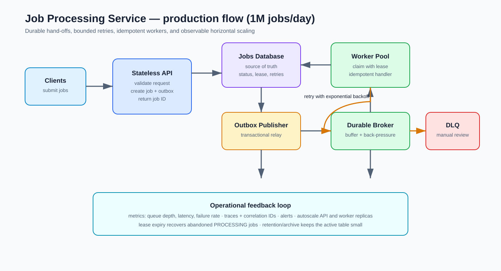

# datphung-nakivo-assessment
Dat Phung's Nakivo Senior Java Developer Take-home Technical Assessment

## Overview

This repository contains a small Spring Boot job processing service. Jobs are
created through an HTTP API, stored in a relational database, and processed in
batches. The application uses Java 21, Spring Boot, Spring Data JPA, Maven, and
H2 for local development and tests.

The runnable Maven project is located in `assessment/`.

## Requirements

- Java 21 (Java 17 or newer is required by the assessment)
- Maven Wrapper

## Run Locally

From the repository root:

```bash
cd assessment
./mvnw spring-boot:run
```

The application starts on `http://localhost:8080`. The default profile uses a
file-backed H2 database at `assessment/data/`.

## Tests
Run unit test only with 

```bash
cd assessment
./mvnw test
```

Run unit and integration tests with:

```bash
cd assessment
./mvnw verify
```

The integration tests use an in-memory H2 database and the `test` profile - and it would not affect the persistent db

## API
For convenience, import the Postman collection at `postman/Naviko - Tech Assessment.postman_collection.json` and use it to test the endpoints.

### Create a job

```bash
curl -i -X POST http://localhost:8080/api/jobs \
	-H 'Content-Type: application/json' \
	-d '{
		"type": "EMAIL",
		"payload": {
			"recipient": "test@example.com",
			"subject": "Hello",
			"body": "Test message"
		}
	}'
```

The response is `201 Created`, with an `id` response body field and a `Location`
header containing the new job URL. New jobs start with status `PENDING` and
retry count `0`.

### Get a job

```bash
curl http://localhost:8080/api/jobs/{id}
```

An unknown job returns `404 Not Found` with an error body containing `status`,
`error`, `message`, and `timestamp`.

### List jobs

```bash
curl 'http://localhost:8080/api/jobs?status=PENDING&page=0&size=20'
```

The `status` parameter is optional. Results are sorted by newest `createdAt`
first and include `content`, `page`, `size`, `totalElements`, and `totalPages`.

### Process pending jobs

```bash
curl -X POST http://localhost:8080/api/jobs/process
```

The response contains counts for `completed`, `failed`, `retries`, and `total`.
The default batch size is `100`.

Processing succeeds unless the payload contains:

```json
{"fail": true}
```

Failed attempts increment `retryCount`, store an `errorMessage`, and return the
job to `PENDING` until the third attempt. The third failed attempt changes the
job to `FAILED`.

## Design Notes

Jobs use the following state transitions:

```text
PENDING -> PROCESSING -> COMPLETED
                      -> PENDING  (retry available)
                      -> FAILED   (maximum retries reached)
```

Before processing, `JobClaimService` selects pending rows in creation order
with `FOR UPDATE SKIP LOCKED` inside a transaction and changes them to
`PROCESSING`. This lets multiple application instances claim different jobs
without waiting on rows already claimed by another instance. Processing then
updates the claimed job in its own transaction.

This is intentionally a simple batch design. A production implementation would
also need recovery for jobs left in `PROCESSING` after a worker crash, such as a
lease or visibility timeout, and would need monitoring and alerting for stuck or
repeatedly failing jobs.

The batch size and retry policy are configured in `application.properties`.

```
job.batch-size=100
job.max-retries=3
```

## System Design: Scaling to One Million Jobs per Day



At production scale, I would separate job submission from job execution. The
API would validate the request and persist the job, then publish a job ID to a
durable queue or broker. Workers would consume messages and update job state in
the database. The database remains the source of truth for job status, while
the broker absorbs bursts and provides back-pressure.

The worker flow would claim a job with a short lease or an atomic state update,
perform the work, and acknowledge the message only after the result is
persisted. Transient failures would use bounded retries with exponential
backoff. Permanent failures or exhausted retries would be sent to a dead-letter
queue and marked `FAILED`. Idempotency keys and idempotent handlers would limit
side effects when a message is redelivered.

The service could scale horizontally by adding stateless API instances and
worker instances. Queue depth, processing latency, failure rate, and database
capacity would drive autoscaling. Operationally, I would add structured logs,
correlation IDs, metrics, tracing, health checks, dashboards, and alerts. The
database would use connection-pool limits, retention/archive policies, backups,
and a migration tool such as Flyway or Liquibase instead of runtime schema
updates.

## Database Performance: 50 Million Jobs

I would first capture the slow query and measure its latency, frequency,
returned rows, and execution plan with `EXPLAIN` or `EXPLAIN ANALYZE`. I would
check whether the query is doing a full table scan or an expensive sort, inspect
index selectivity and statistics, and review database CPU, memory, I/O, locks,
connection-pool usage, and concurrent traffic.

The likely first improvement is an index matching the filter and ordering, for
example `(status, created_at DESC, id)`; the exact definition should be checked
against the database engine and query plan. I would refresh statistics and
confirm that pagination uses the index. For that much records, I would replace
offset-based pagination with cursor-based pagination using the last `(created_at,
id)` pair, which avoids scanning and discarding a growing number of rows.

For long-term growth, completed and old jobs could be archived or partitioned
by time, with retention rules keeping the active table small. Read replicas or
a dedicated query store may help read-heavy workloads, but they add operational
complexity and can introduce replication lag. Indexes improve reads but consume
storage and slow inserts and updates, while partitioning improves maintenance
but complicates queries and schema operations. Every change should be validated
against production-like data and execution plans.
